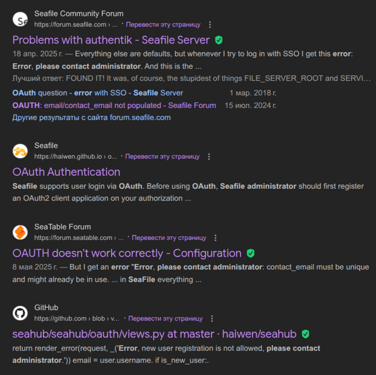
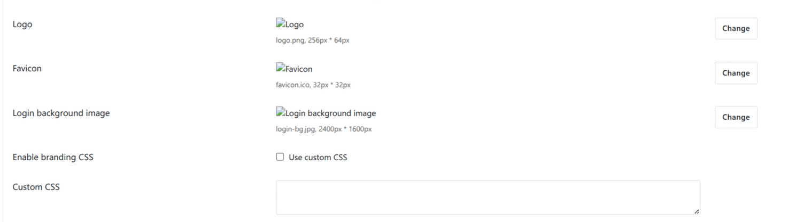
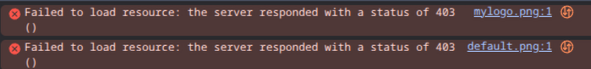
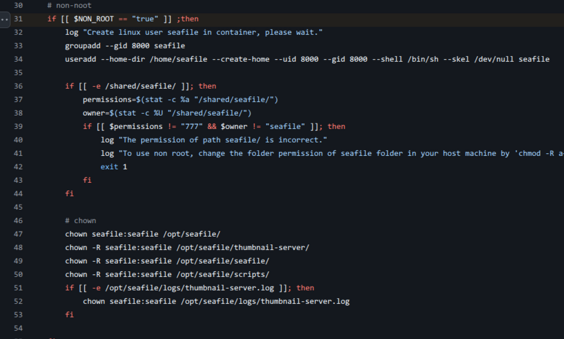

+++
date = '2026-01-04'
title = 'The Painful Seafile Experience'
+++


Hello everyone, I've spent the last few days trying unsuccessfully to configure Seafile, and now I'd like to share my painful experience.


# Nextcloud vs Seafile

I had previously tried using Nextcloud (4-5 years ago), but let's just say that I quickly became disappointed with PHP projects, and if I may say so, they are devilishly slow and sad.


Of all the options, Seafile was the only one that didn't require money and looked good in terms of functionality. It was also stated that its daemon was written in C, which gave hope for high-quality implementation.

## Shitty Sign-On

I tried to avoid stupid problems using seafile-ce, but unfortunately I encountered terrible documentation while trying to set up SSO.

The SSO documentation is terribly brief, without proper descriptions of the fields and with awful examples of integration with all kinds of junk like Azure.



The problem was that fields not described in the documentation turned out to be extremely important, and without them, the server simply caught an error.

## Permission issues

After I resigned myself to the fact that it wouldn't work out nicely and I would have to do it badly, I was faced with my eternal problem with seafile.

| So what's the problem?

Oh it's pretty simple, by default seafile writes files as the `root` user and reads them as the `root` user, and it seems like:

| wow, that's cool, there can't be any problems here, right? right?




Well, no, the built-in nginx that streams the contents of these directories is not able to read the files that Seafile itself wrote, because nginx is using `www-data` user by default, and we get a terribly stupid situation where the user sets an avatar for themselves, and this avatar becomes a `403` error.



This problem has existed since 2020-2021 for sure, and developers definitely know about it.

## Okay

A new user will google and find the mysterious `NON_ROOT` mode and think that this is the solution to their problems, because if we write files not as `root`, then everything is fine.

But hell no, the developers didn't give a damn about this feature, and therefore enabling this mode will simply break your instance and it will be impossible to start it, displaying a message:

```To use non root, change the folder permission of seafile folder in your host machine by 'chmod -R a+rwx /opt/seafile-data/seafile/'```

## Okay x2

Unfortunately, the imbecile developer doesn't write that he's not just waiting for `a+rwx` permissions on the folder, but also waiting for the ~magical~ `seafile` user, which of course isn't mentioned in the documentation, and you won't find out about it without looking into the script.



Exhausted and weary from wasting six hours of your worthless life, you create a user and a group on the server following the script, after which you enjoy a f***ing Python error that can only be solved by forking the project.


## Beautiful logs

The cherry on top of this “cake” is the completely broken logs, which makes the process of debugging dumb documentation examples an adventure lasting dozens of hours.

In my case, I simply did not receive any application error logs in either the Docker logs or Seafile logs files.


### "harmed" in the making of this post

- one ampere server
- one developer
- one debian 13
- one docker
- two seafile 11-13 installations
