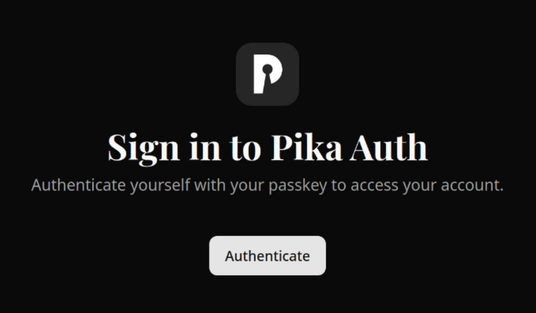
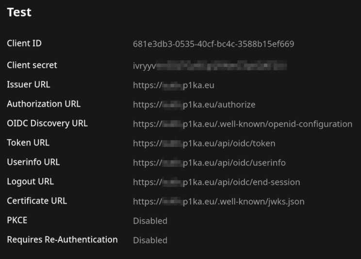

+++
date = '2026-01-07'
title = "Why doesn't Passkeys work between KeePassXC and KeePassDX?"
+++

## TLDR
In [KeepassDX] go to **Settings** > **Form filling** > **Passkeys settings** and disable **Backup Eligibility** option.

## Long version
So, recently at Pika Software we started using [PocketID] + [Tinyauth] as our authetication.

[PocketID] is used as OIDC provider, which means an application requests user information for authentication,
like when you sing in with Google.

And [Tinyauth] protects our page that does not support OIDC, for example like [Uptime Kuma] 

*well, until [BetterAuth PR](https://github.com/louislam/uptime-kuma/pull/6276) is not merged*

One thing of [PocketID] that sets it apart, it uses **Passkeys** as its main and *only* method of authentication. 
And also it is simple to use, fast, and does not consume much memory.

*56M for [PocketID] + 38M [Tinyauth]*

Compared to [Authelia] it was a breeze to setup! No need to read [throughly the documentation](https://www.authelia.com/configuration/prologue/common/)

Here is an example of values that [PocketID] provide for your OIDC clients:

---

Anyway, where were we? 
Oh, yeah, since [PocketID] uses **passkeys**, you need to somehow *use* and *store* somewhere the passkeys.
And it mostly depends on your:
1. Browser
2. Operating System
3. Devices (including security keys)

So, if use latest browser version on all OSes, you can store a passkey on a **security key**.
If you are on Windows or MacOS with bluetooth, [you can use a phone for passkey authentication](https://docs.github.com/en/authentication/authenticating-with-a-passkey/signing-in-with-a-passkey#signing-in-with-a-passkey-using-a-nearby-device).

Lastly, on Windows you can store passkeys locally. [On MacOS too, but I wouldn't recommend it](https://fy.blackhats.net.au/blog/2024-04-26-passkeys-a-shattered-dream/#the-enshittocene-period)

> Apple Keychain has personally wiped out all my Passkeys on three separate occasions. 
> There are external reports we have recieved of other users who's Keychain Passkeys have been wiped just like mine.
>
> UPDATE 2025-05: It's four times now my passkey have been wiped out.

*any you can't even use Apple Keychain without an Apple account*

On Android there is also shady support for passkeys. I could setup Samsung Pass to save passkey on my phone, 
but my friend with Xiaomi could only do it in Microsoft Authentication App.

As you can see, Linux is absent in last two methods, you can't store passkeys locally or use a phone for passkeys.
That only leaves you with a security key.

So, what are your options?

## Finally, KeePass part!
Instead you can rely on password manager application, be it [KeePassXC] or [Bitwarden]. Personally I use [KeePassXC] on PC, [KeePassDX] on phone, and everything is synced with [Syncthing].

But after I have tried using a passkey saved with [KeePassDX] in [KeePassXC], I would get an error. Same with [KeePassXC] passkeys on [KeePassDX].

The solution was found at <https://github.com/Kunzisoft/KeePassDX/issues/2172>

You just need in [KeePassDX] go to **Settings** > **Form filling** > **Passkeys settings** and disable **Backup Eligibility** option.

If you have created previously a passkey in [KeePassDX], and it still does not work, try to recreate it with the option disabled.

---

*- written by Retro with ❤️*

[KeePassDX]: https://github.com/Kunzisoft/KeePassDX
[KeePassXC]: https://github.com/keepassxreboot/keepassxc
[PocketID]: https://github.com/pocket-id/pocket-id
[Tinyauth]: https://github.com/steveiliop56/tinyauth
[Uptime Kuma]: https://github.com/louislam/uptime-kuma
[Authelia]: https://github.com/authelia/authelia
[Bitwarden]: https://bitwarden.com/
[Syncthing]: https://github.com/syncthing/syncthing
